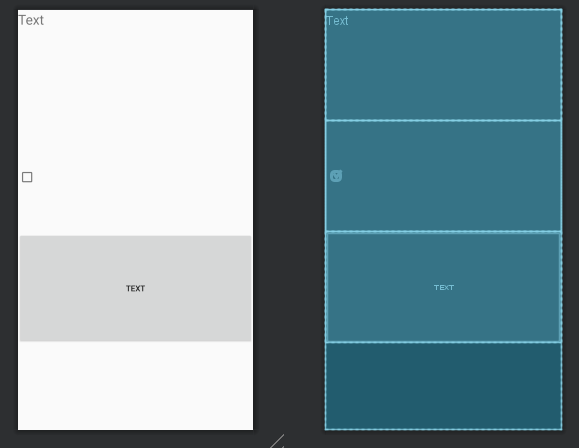
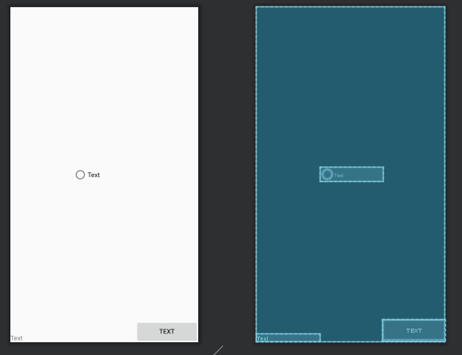
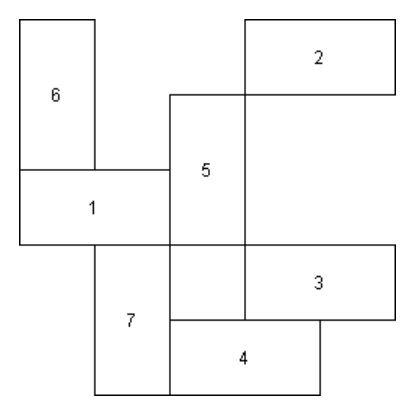
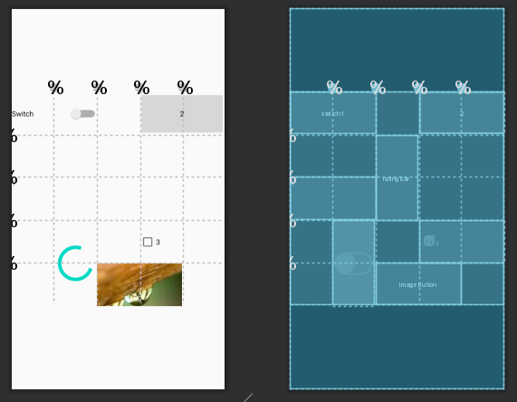

# Цели
  - Ознакомиться со средой разработки Android Studio
  - Изучить основные принципы верстки layout с использованием View и ViewGroup
  - Изучить основные возможности и свойства LinearLayout
  - Изучить основные возможности и свойства ConstraintLayout
# Программа работы
### Задача 1. LinearLayout
##### Создать layout ресурсы для следующих макетов экрана с использованием LinearLayout.
**Задание 1**

*Рисунок 1.1. Задание №1. Вариант №12*


*Код программы:*
```
<?xml version="1.0" encoding="utf-8"?>
<LinearLayout
    xmlns:android="http://schemas.android.com/apk/res/android"
    xmlns:tools="http://schemas.android.com/tools"
    android:layout_width="match_parent"
    android:layout_height="match_parent"
    tools:context=".MainActivity"
    android:orientation="vertical">

    <TextView
        android:id="@+id/textView2"
        android:layout_width="match_parent"
        android:layout_height="0dp"
        android:layout_weight="1"
        android:text="@string/text"
        android:textSize="24sp" />

    <CheckBox
        android:layout_width="match_parent"
        android:layout_height="0dp"
        android:layout_weight="1"
        />


    <Button
        android:id="@+id/button"
        android:layout_width="match_parent"
        android:layout_height="0dp"
        android:layout_marginBottom="150dp"
        android:layout_weight="1"
        android:text="@string/text" />

</LinearLayout>
```

**Результат**

*Рис.1.2. Макет экрана в Android Studio*


*** 

**Задание 1, второе решение**

*Код программы:*
```
<?xml version="1.0" encoding="utf-8"?>
<LinearLayout
    xmlns:android="http://schemas.android.com/apk/res/android"
    xmlns:app="http://schemas.android.com/apk/res-auto"
    xmlns:tools="http://schemas.android.com/tools"
    android:layout_width="match_parent"
    android:layout_height="match_parent"
    android:orientation="vertical">


    <TextView
        android:id="@+id/textView4"
        android:layout_width="match_parent"
        android:layout_height="0dp"
        android:layout_weight="1"
        android:text="@string/textview" />

    <ImageView
        android:id="@+id/imageView"
        android:layout_width="match_parent"
        android:layout_height="0dp"
        android:layout_weight="1"
        tools:srcCompat="@tools:sample/avatars" />

    <Button
        android:id="@+id/button4"
        android:layout_width="match_parent"
        android:layout_height="0dp"
        android:layout_weight="1"
        android:text="@string/button" />

    <Space
        android:layout_width="match_parent"
        android:layout_height="150dp" />
</LinearLayout>
```

*Рис.1.3. Макет экрана в Android Studio*


*** 

**Задание 2**

*Рисунок 1.4. Задание №2. Вариант №21*


*Код программы:*
```
<?xml version="1.0" encoding="utf-8"?>
<LinearLayout
    xmlns:android="http://schemas.android.com/apk/res/android"
    android:layout_width="match_parent"
    android:layout_height="match_parent"
    android:orientation="horizontal">

    <TextView
        android:id="@+id/textView"
        android:layout_width="0dp"
        android:layout_height="wrap_content"
        android:layout_weight="1"
        android:text="@string/text"
        android:layout_gravity="bottom" />

    <RadioButton
        android:id="@+id/radioButton"
        android:layout_width="0dp"
        android:layout_height="wrap_content"
        android:layout_gravity="center"
        android:layout_weight="1"
        android:text="@string/text" />

    <Button
        android:id="@+id/button2"
        android:layout_width="0dp"
        android:layout_height="wrap_content"
        android:layout_weight="1"
        android:text="@string/text"
        android:layout_gravity="bottom" />
</LinearLayout>
```

*Рис.1.5. Макет экрана в Android Studio*


***

### Задача 2. ConstraintLayout
##### Решите задачу 1 (обе подзадачи) с использованием ConstraintLayout.
**Задание 1**

*Код программы:*
```
<?xml version="1.0" encoding="utf-8"?>
<androidx.constraintlayout.widget.ConstraintLayout xmlns:android="http://schemas.android.com/apk/res/android"
    xmlns:app="http://schemas.android.com/apk/res-auto"
    xmlns:tools="http://schemas.android.com/tools"
    android:id="@+id/linearLayout2"
    android:layout_width="match_parent"
    android:layout_height="match_parent"
    tools:context=".MainActivity">

    <TextView
        android:id="@+id/textView2"
        android:layout_width="0dp"
        android:layout_height="0dp"
        android:layout_marginBottom="193dp"
        android:text="@string/text"
        android:textSize="24sp"
        app:layout_constraintBottom_toTopOf="@+id/button"
        app:layout_constraintEnd_toEndOf="parent"
        app:layout_constraintStart_toStartOf="parent"
        app:layout_constraintTop_toTopOf="parent" />

    <CheckBox
        android:id="@+id/checkBox"
        android:layout_width="0dp"
        android:layout_height="0dp"
        android:layout_marginTop="194dp"
        android:layout_marginBottom="193dp"
        app:layout_constraintBottom_toBottomOf="@+id/button"
        app:layout_constraintEnd_toEndOf="parent"
        app:layout_constraintStart_toStartOf="parent"
        app:layout_constraintTop_toTopOf="parent" />


    <Button
        android:id="@+id/button"
        android:layout_width="0dp"
        android:layout_height="0dp"
        android:layout_marginBottom="150dp"
        android:text="@string/text"
        app:layout_constraintBottom_toBottomOf="parent"
        app:layout_constraintEnd_toEndOf="parent"
        app:layout_constraintStart_toStartOf="parent"
        app:layout_constraintTop_toBottomOf="@+id/textView2" />

</androidx.constraintlayout.widget.ConstraintLayout>
```

**Результат**

*Рис.1.6. Макет экрана в Android Studio*



*** 

**Задание 2**

*Код программы:*
```
<?xml version="1.0" encoding="utf-8"?>
<androidx.constraintlayout.widget.ConstraintLayout xmlns:android="http://schemas.android.com/apk/res/android"
    xmlns:app="http://schemas.android.com/apk/res-auto"
    android:id="@+id/linearLayout"
    android:layout_width="match_parent"
    android:layout_height="match_parent">

    <TextView
        android:id="@+id/textView"
        android:layout_width="0dp"
        android:layout_height="wrap_content"
        android:text="@string/text"
        app:layout_constraintBottom_toBottomOf="parent"
        app:layout_constraintEnd_toStartOf="@+id/radioButton"
        app:layout_constraintStart_toStartOf="parent" />

    <RadioButton
        android:id="@+id/radioButton"
        android:layout_width="0dp"
        android:layout_height="wrap_content"
        android:text="@string/text"
        app:layout_constraintBottom_toBottomOf="parent"
        app:layout_constraintEnd_toStartOf="@+id/button2"
        app:layout_constraintStart_toEndOf="@+id/textView"
        app:layout_constraintTop_toTopOf="parent" />

    <Button
        android:id="@+id/button2"
        android:layout_width="0dp"
        android:layout_height="wrap_content"
        android:text="@string/text"
        app:layout_constraintBottom_toBottomOf="parent"
        app:layout_constraintEnd_toEndOf="parent"
        app:layout_constraintStart_toEndOf="@+id/radioButton" />
</androidx.constraintlayout.widget.ConstraintLayout>
```

*Рис.1.7. Макет экрана в Android Studio*



*** 

### Задача 3. ConstraintLayout
##### Создайте layout ресурс для следующего макета экрана с использованием ConstraintLayout.
*Рисунок 3.1. Задание. Вариант №12*



*Код программы:*
```
<?xml version="1.0" encoding="utf-8"?>
<androidx.constraintlayout.widget.ConstraintLayout
    xmlns:android="http://schemas.android.com/apk/res/android"
    xmlns:app="http://schemas.android.com/apk/res-auto"
    xmlns:tools="http://schemas.android.com/tools"
    android:layout_width="match_parent"
    android:layout_height="match_parent">

    <androidx.constraintlayout.widget.ConstraintLayout
        android:layout_width="0dp"
        android:layout_height="0dp"
        app:layout_constraintBottom_toBottomOf="parent"
        app:layout_constraintDimensionRatio="1"
        app:layout_constraintEnd_toEndOf="parent"
        app:layout_constraintHorizontal_bias="1.0"
        app:layout_constraintStart_toStartOf="parent"
        app:layout_constraintTop_toTopOf="parent" >

        <androidx.constraintlayout.widget.Guideline
            android:id="@+id/guideline"
            android:layout_width="0dp"
            android:layout_height="0dp"
            android:orientation="horizontal"
            app:layout_constraintGuide_percent="0.2" />

        <androidx.constraintlayout.widget.Guideline
            android:id="@+id/guideline2"
            android:layout_width="0dp"
            android:layout_height="0dp"
            android:orientation="horizontal"
            app:layout_constraintGuide_percent="0.4" />

        <androidx.constraintlayout.widget.Guideline
            android:id="@+id/guideline3"
            android:layout_width="0dp"
            android:layout_height="0dp"
            android:orientation="horizontal"
            app:layout_constraintGuide_percent="0.6" />

        <androidx.constraintlayout.widget.Guideline
            android:id="@+id/guideline4"
            android:layout_width="0dp"
            android:layout_height="0dp"
            android:orientation="horizontal"
            app:layout_constraintGuide_percent="0.8" />

        <androidx.constraintlayout.widget.Guideline
            android:id="@+id/guideline5"
            android:layout_width="0dp"
            android:layout_height="0dp"
            android:orientation="vertical"
            app:layout_constraintGuide_percent="0.2" />

        <androidx.constraintlayout.widget.Guideline
            android:id="@+id/guideline6"
            android:layout_width="0dp"
            android:layout_height="0dp"
            android:orientation="vertical"
            app:layout_constraintGuide_percent="0.4" />

        <androidx.constraintlayout.widget.Guideline
            android:id="@+id/guideline7"
            android:layout_width="0dp"
            android:layout_height="0dp"
            android:orientation="vertical"
            app:layout_constraintGuide_percent="0.6" />

        <androidx.constraintlayout.widget.Guideline
            android:id="@+id/guideline8"
            android:layout_width="0dp"
            android:layout_height="0dp"
            android:orientation="vertical"
            app:layout_constraintGuide_percent="0.8" />

        <TextView
            android:id="@+id/textView3"
            android:layout_width="0dp"
            android:layout_height="0dp"
            android:text="@string/_1"
            app:layout_constraintBottom_toTopOf="@+id/guideline3"
            app:layout_constraintEnd_toStartOf="@+id/guideline6"
            app:layout_constraintStart_toStartOf="parent"
            app:layout_constraintTop_toTopOf="@+id/guideline2" />

        <Button
            android:id="@+id/button3"
            android:layout_width="0dp"
            android:layout_height="0dp"
            android:text="@string/_2"
            app:layout_constraintBottom_toTopOf="@+id/guideline"
            app:layout_constraintEnd_toEndOf="parent"
            app:layout_constraintStart_toStartOf="@+id/guideline7"
            app:layout_constraintTop_toTopOf="parent" />

        <CheckBox
            android:id="@+id/checkBox2"
            android:layout_width="0dp"
            android:layout_height="0dp"
            android:text="@string/_3"
            app:layout_constraintBottom_toTopOf="@+id/guideline4"
            app:layout_constraintEnd_toEndOf="parent"
            app:layout_constraintStart_toStartOf="@+id/guideline7"
            app:layout_constraintTop_toTopOf="@+id/guideline3" />

        <ImageButton
            android:id="@+id/imageButton"
            android:layout_width="0dp"
            android:layout_height="0dp"
            app:layout_constraintBottom_toBottomOf="parent"
            app:layout_constraintEnd_toStartOf="@+id/guideline8"
            app:layout_constraintStart_toStartOf="@+id/guideline6"
            app:layout_constraintTop_toTopOf="@+id/guideline4"
            tools:srcCompat="@tools:sample/backgrounds/scenic"
            android:contentDescription="@string/imagebutton" />


        <androidx.appcompat.widget.SwitchCompat
            android:id="@+id/switch1"
            android:layout_width="0dp"
            android:layout_height="0dp"
            android:text="@string/switch1"
            app:layout_constraintBottom_toTopOf="@+id/guideline"
            app:layout_constraintEnd_toStartOf="@+id/guideline6"
            app:layout_constraintStart_toStartOf="parent"
            app:layout_constraintTop_toTopOf="parent" />

        <ProgressBar
            android:id="@+id/progressBar"
            style="?android:attr/progressBarStyle"
            android:layout_width="0dp"
            android:layout_height="0dp"
            app:layout_constraintBottom_toBottomOf="parent"
            app:layout_constraintEnd_toStartOf="@+id/guideline6"
            app:layout_constraintStart_toStartOf="@+id/guideline5"
            app:layout_constraintTop_toTopOf="@+id/guideline3" />

        <RatingBar
            android:id="@+id/ratingBar"
            android:layout_width="0dp"
            android:layout_height="0dp"
            app:layout_constraintBottom_toTopOf="@+id/guideline3"
            app:layout_constraintEnd_toStartOf="@+id/guideline7"
            app:layout_constraintStart_toStartOf="@+id/guideline6"
            app:layout_constraintTop_toTopOf="@+id/guideline" />

    </androidx.constraintlayout.widget.ConstraintLayout>
</androidx.constraintlayout.widget.ConstraintLayout>
```

**Результат**

*Рис.1.8. Макет экрана в Android Studio*



***

### Вывод
