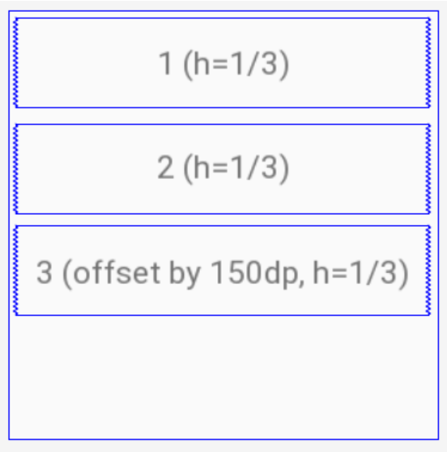
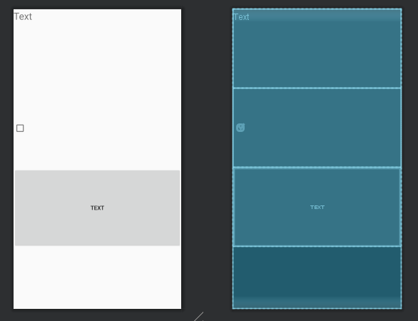
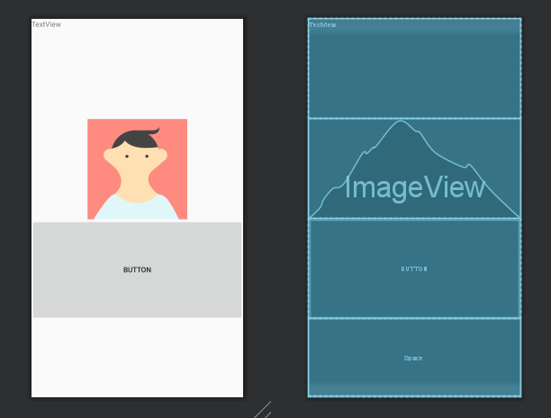
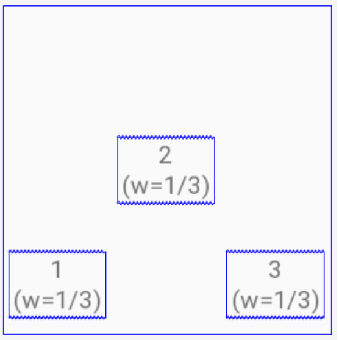
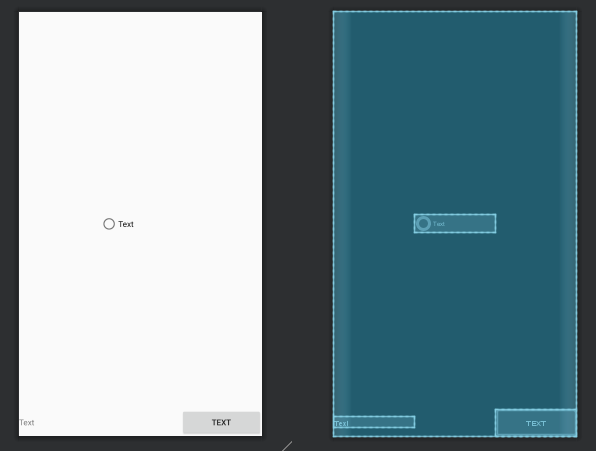

# Цели
  - Ознакомиться со средой разработки Android Studio
  - Изучить основные принципы верстки layout с использованием View и ViewGroup
  - Изучить основные возможности и свойства LinearLayout
  - Изучить основные возможности и свойства ConstraintLayout
# Программа работы
### 1.	 Задача 1. LinearLayout
##### 1.1 Создать layout ресурсы для следующих макетов экрана с использованием LinearLayout.
**Задание 1**

*Рисунок 1.1. Задание №1. Вариант №12*



*Код программы:*
```
<?xml version="1.0" encoding="utf-8"?>
<LinearLayout
    xmlns:android="http://schemas.android.com/apk/res/android"
    xmlns:tools="http://schemas.android.com/tools"
    android:layout_width="match_parent"
    android:layout_height="match_parent"
    tools:context=".MainActivity"
    android:orientation="vertical">

    <TextView
        android:id="@+id/textView2"
        android:layout_width="match_parent"
        android:layout_height="0dp"
        android:layout_weight="1"
        android:text="@string/text"
        android:textSize="24sp" />

    <CheckBox
        android:layout_width="match_parent"
        android:layout_height="0dp"
        android:layout_weight="1"
        />


    <Button
        android:id="@+id/button"
        android:layout_width="match_parent"
        android:layout_height="0dp"
        android:layout_marginBottom="150dp"
        android:layout_weight="1"
        android:text="@string/text" />

</LinearLayout>
```

**Результат**

*Рис.1.2. Макет экрана в Android Studio*



*** 

**Задание 1, второе решение**

*Код программы:*
```
<?xml version="1.0" encoding="utf-8"?>
<LinearLayout
    xmlns:android="http://schemas.android.com/apk/res/android"
    xmlns:app="http://schemas.android.com/apk/res-auto"
    xmlns:tools="http://schemas.android.com/tools"
    android:layout_width="match_parent"
    android:layout_height="match_parent"
    android:orientation="vertical">


    <TextView
        android:id="@+id/textView4"
        android:layout_width="match_parent"
        android:layout_height="0dp"
        android:layout_weight="1"
        android:text="@string/textview" />

    <ImageView
        android:id="@+id/imageView"
        android:layout_width="match_parent"
        android:layout_height="0dp"
        android:layout_weight="1"
        tools:srcCompat="@tools:sample/avatars" />

    <Button
        android:id="@+id/button4"
        android:layout_width="match_parent"
        android:layout_height="0dp"
        android:layout_weight="1"
        android:text="@string/button" />

    <Space
        android:layout_width="match_parent"
        android:layout_height="150dp" />
</LinearLayout>
```

*Рис.1.3. Макет экрана в Android Studio*



*** 

**Задание 2**

*Рисунок 1.4. Задание №2. Вариант №21*



*Код программы:*
```
<?xml version="1.0" encoding="utf-8"?>
<LinearLayout
    xmlns:android="http://schemas.android.com/apk/res/android"
    android:layout_width="match_parent"
    android:layout_height="match_parent"
    android:orientation="horizontal">

    <TextView
        android:id="@+id/textView"
        android:layout_width="0dp"
        android:layout_height="wrap_content"
        android:layout_weight="1"
        android:text="@string/text"
        android:layout_gravity="bottom" />

    <RadioButton
        android:id="@+id/radioButton"
        android:layout_width="0dp"
        android:layout_height="wrap_content"
        android:layout_gravity="center"
        android:layout_weight="1"
        android:text="@string/text" />

    <Button
        android:id="@+id/button2"
        android:layout_width="0dp"
        android:layout_height="wrap_content"
        android:layout_weight="1"
        android:text="@string/text"
        android:layout_gravity="bottom" />
</LinearLayout>
```

*Рис.1.5. Макет экрана в Android Studio*


